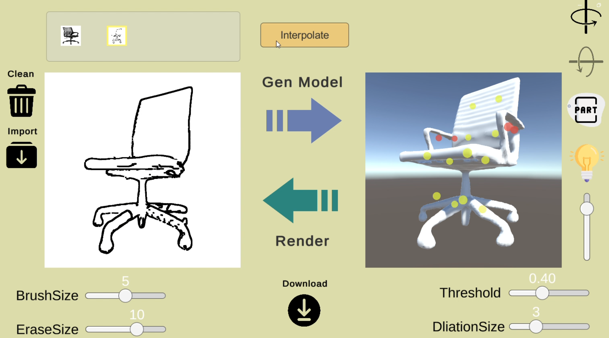

# SketchGen
MLSP Final (use SENS to generate 3d model by 2d sketch)

 <!-- 建議將圖片放在專案中，或使用線上連結 -->

---

## 🔗 Demo 連結

▶️ [點此觀看 Demo影片](https://youtu.be/cnBoTrFhfJs) 

🕹️ [點此觀看 WebGL Demo（建議使用桌面版 Chrome 或 Edge 瀏覽器）](https://briangodd.itch.io/sketchgen-ver1) 

---

## 🏁 快速開始

```bash
# 下載Sketch介面化專案
git clone https://github.com/BrianGodd/SketchGen.git

# 下載Generation Server專案
git clone https://github.com/AlexandreBinninger/SENS.git

# 將SketchGen>python中的python code複製到Server專案root資料夾中
-api_server.py (新增)
-run.py (覆蓋)
-constants.py (覆蓋)
-custom_types.py (覆蓋)

# run api_server.py 開啟 gen server
- python api_server.py

# 切換至Sketch介面Unity專案，直接 Play Run 即可
